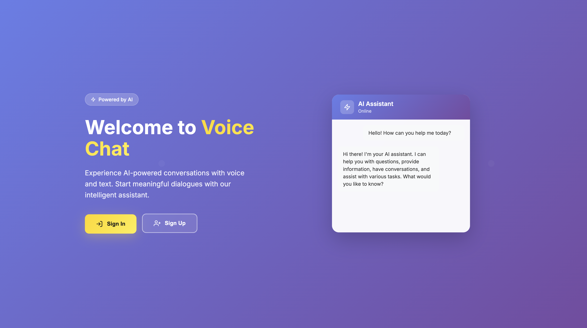
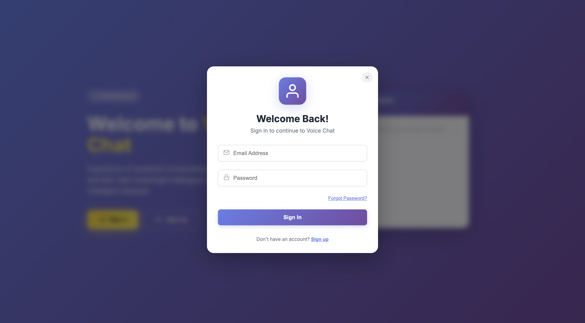
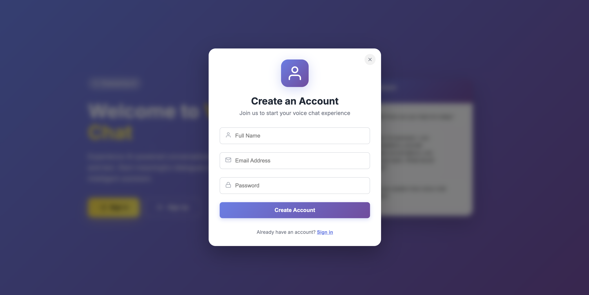
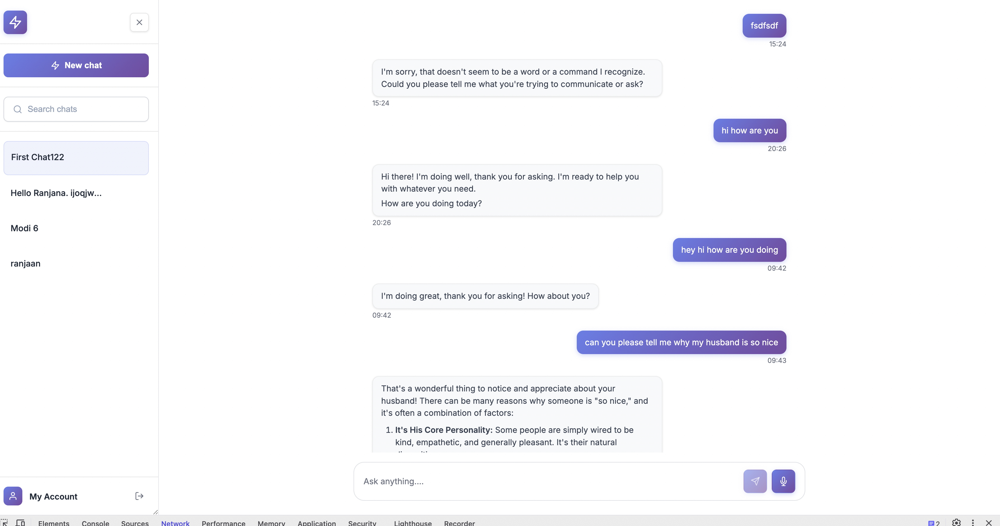
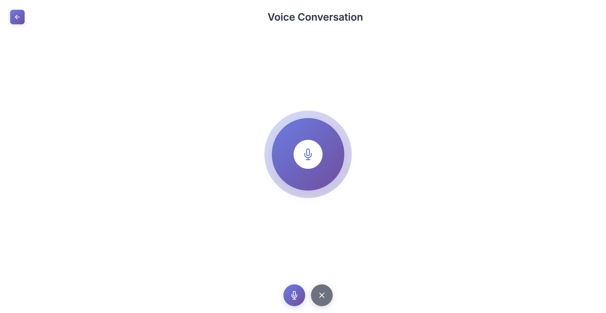

# NeuraTalk

A real-time AI chat application with voice conversation capabilities, powered by Google's Gemini AI. I built this to experiment with combining voice interaction and AI in a seamless way—users can either type their questions or have a full voice conversation with the AI assistant.

## Features

- **Text Chat Interface** — Clean, ChatGPT-style interface for text-based conversations
- **Voice Conversation Mode** — Hands-free voice interactions using Web Speech API
- **Real-time Streaming** — AI responses stream in real-time via WebSocket connections
- **User Authentication** — JWT-based auth with login and registration
- **Session Management** — Save and retrieve past conversations
- **Speech Synthesis** — Bot responses are spoken back to the user
- **Responsive Design** — Works across different screen sizes

## Tech Stack

**Frontend:**
- React 19.1.1
- React Router for navigation
- Socket.io-client for real-time communication
- Web Speech API (speech recognition & synthesis)
- Axios for HTTP requests
- React Icons for UI elements
- Markdown preview for formatted responses

**Backend:**
- Node.js + Express 5
- Socket.io for WebSocket connections
- MongoDB + Mongoose for data persistence
- JWT for authentication
- bcrypt for password hashing
- Google Gemini AI (gemini-2.5-flash model)

## Folder Structure

```
neuratalk/
├── neura-frontend/          # React frontend
│   ├── src/
│   │   ├── components/      # Reusable UI components
│   │   │   ├── Chat/        # Main chat interface
│   │   │   ├── VoiceScreen/ # Voice conversation UI
│   │   │   ├── Sidebar/     # Chat sessions sidebar
│   │   │   ├── Message/     # Message bubble component
│   │   │   ├── AuthModal/   # Login/Register modal
│   │   │   └── ...
│   │   ├── pages/           # Page components
│   │   └── api.js           # Axios configuration
│   └── public/
│
└── neura-backend/           # Express backend
    ├── models/              # Mongoose schemas
    │   ├── User.js
    │   ├── ChatSession.js
    │   └── Question.js
    ├── routes/              # API routes
    │   ├── auth.js          # Authentication endpoints
    │   └── chat.js          # Chat endpoints
    ├── services/            # External services
    │   └── geminiService.js # Gemini AI integration
    ├── middleware/
    │   └── authMiddleware.js
    └── server.js            # Main server file
```

## Installation & Setup

### Prerequisites

- Node.js (v14 or higher)
- MongoDB instance (local or cloud)
- Google Gemini API key

### Backend Setup

1. Navigate to the backend directory:
```bash
cd neura-backend
```

2. Install dependencies:
```bash
npm install
```

3. Create a `.env` file in `neura-backend/` with the following:
```env
PORT=4000
MONGO_URI=your_mongodb_connection_string
JWT_SECRET=your_jwt_secret_key
GEMINI_API_KEY=your_gemini_api_key
```

### Frontend Setup

1. Navigate to the frontend directory:
```bash
cd neura-frontend
```

2. Install dependencies:
```bash
npm install
```

3. Update the API URL in `src/api.js` and `src/components/VoiceScreen/index.js` if needed (default is `http://localhost:4000`)

## How to Run the Project

### Start the Backend

```bash
cd neura-backend
npm run dev
```

The server will start on `http://localhost:4000`

### Start the Frontend

```bash
cd neura-frontend
npm start
```

The React app will open at `http://localhost:3000`

### Usage Flow

1. Register a new account or login
2. Start a new chat session
3. Type your questions in the text input, or
4. Click the voice icon to switch to voice conversation mode
5. In voice mode, click the mic button and start speaking
6. The AI will respond both in text and with voice

## Screenshots

### Landing Page
The welcome screen with AI assistant preview and quick access to sign in/sign up.



### Authentication
Login and registration modals with clean, modern design.




### Chat Interface
Full chat interface with sidebar showing conversation history, message area with markdown support, and input controls.



### Voice Conversation Mode
Dedicated voice interface with animated microphone visualization and voice controls.



## API Details

### Authentication Endpoints

**POST** `/api/auth/register`
```json
{
  "username": "john_doe",
  "email": "john@example.com",
  "password": "password123"
}
```

**POST** `/api/auth/login`
```json
{
  "email": "john@example.com",
  "password": "password123"
}
```

### Chat Endpoints

**POST** `/api/chat/new` — Create a new chat session

**GET** `/api/chat/:sessionId` — Get all messages from a session

**POST** `/api/chat/:sessionId/question` — Send a question to the AI
```json
{
  "questionText": "What is quantum computing?"
}
```

### WebSocket Events

**Client → Server:**
- `user_message` — Send a message to the AI
- `interrupt` — Stop the AI response

**Server → Client:**
- `assistant_chunk` — Streaming response chunks
- `assistant_done` — Response completed
- `assistant_error` — Error occurred

## Challenges Faced

One thing I struggled with was managing the voice recognition lifecycle. The Web Speech API can be finicky—it stops listening after periods of silence, so I had to implement auto-restart logic. Getting the timing right so the bot doesn't interrupt itself when speaking was tricky.

Another challenge was handling the streaming responses correctly. I initially tried to use HTTP polling but switched to WebSockets to get proper real-time streaming. The Socket.io integration took some debugging to get the events synced properly between frontend and backend.

I also ran into issues with the speech synthesis queue. If multiple responses came in quickly, they would overlap. I ended up adding flags to track when the bot is speaking and preventing new recognition until it finishes.

## What I Learned

This project taught me a lot about real-time communication patterns. Working with WebSockets for the first time was eye-opening—understanding when to use HTTP vs WebSocket connections makes a huge difference in UX.

I also got hands-on experience with the Web Speech API, which is surprisingly powerful but needs careful state management. The differences between interim and final transcripts, handling errors gracefully, and managing microphone permissions all required thoughtful handling.

On the backend side, integrating with Gemini's API was straightforward, but structuring the data models to efficiently store and retrieve conversation history taught me about optimizing MongoDB queries for chat applications.

## Future Improvements

- Add conversation context to improve AI responses across multiple messages
- Implement voice cloning or custom voices for the bot
- Add support for multiple languages
- Implement message editing and regeneration
- Add file upload capabilities for document-based questions
- Create a mobile app version using React Native
- Add conversation sharing and export features
- Implement rate limiting and usage quotas
- Add support for streaming responses in text mode
- Improve error handling and offline support

## Contributing

Contributions are welcome! If you find bugs or have feature suggestions, feel free to open an issue or submit a pull request.

1. Fork the repository
2. Create your feature branch (`git checkout -b feature/AmazingFeature`)
3. Commit your changes (`git commit -m 'Add some AmazingFeature'`)
4. Push to the branch (`git push origin feature/AmazingFeature`)
5. Open a Pull Request

## License

This project is licensed under the MIT License. Feel free to use it for your own projects or learning purposes.

---

Built with ☕ and curiosity about voice AI interfaces.
